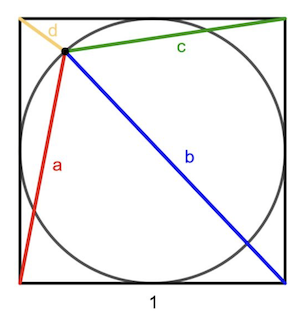

# Quick puzzles

Below are a few of my answers to some maths puzzles, mostly taken from
* https://x.com/mathisstillfun
* https://x.com/mathssolutionz.
* https://mirangu.com

This PDF (TODO) contains the fully worked up answers, but the questions are listed below:

## Wheel of fortune

Unit square and inscribed circle. Find: $a^2 + b^2 + c^2 + d^2$.

From https://mirangu.com/wheel-of-fortune/

Twitter post (first approach): https://x.com/tcorbettclark/status/1692831256810037358

Second approach: https://x.com/tcorbettclark/status/1692585115371577465

# TODO from here

* https://x.com/tcorbettclark/status/1682357430011805698
* https://x.com/tcorbettclark/status/1676132727966375936
* https://x.com/tcorbettclark/status/1675758858831011841
* https://x.com/tcorbettclark/status/1660174431535202309
* https://x.com/tcorbettclark/status/1586618640295682048
* https://x.com/tcorbettclark/status/1581236996563144706
* https://x.com/tcorbettclark/status/1572334490504273928
* https://x.com/tcorbettclark/status/1565333608402866176
* https://x.com/tcorbettclark/status/1558145609214967808
